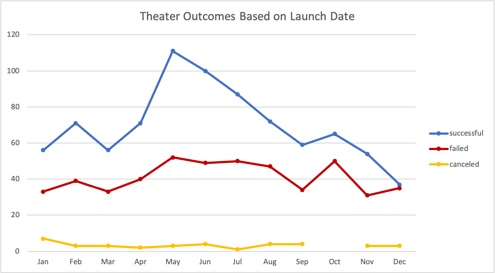
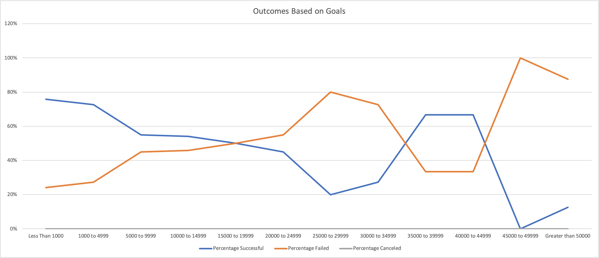

# Kickstarting with Excel

## Overview of Project

### Purpose

The objective of this project was to analyze outcomes of campaigns that had similar cateogries to Louise's campaign. We accomplished this by using Kickstarter data to evaluate campaign results based on launch date and funding goals. Additionally, we visualized this data to help us identify and better understand trends.

## Analysis and Challenges

### Analysis of Outcomes Based on Launch Date

First, we created a "Years" column by using the `YEAR()` function on our "Date Created Conversion" column in Excel. 
Then, we generated a pivot table that could be filtered by "Parent Category" and "Years", and showed the relationship between outcomes and launch month. 
Next, we filtered "outcomes" to exclude "live" campaigns and we filtered "Parent Category" to only show "theater" results. 
Lastly, we created a line chart to help visualize the relationship. 

### Analysis of Outcomes Based on Goals

First, we defined ranges for the goal amounts.
Then, we used `COUNTIFS()` to tally and filter the number of campaigns by goal-amount range, outcome, and subcategory as seen in the code below:
```
=COUNTIFS(Kickstarter!D2:D4115, ">=1000", Kickstarter!D2:D4115, "<5000", Kickstarter!F2:F4115,"successful",Kickstarter!R2:R4115,"plays")
```
Next, we used `SUM()` to calculate the total projects per goal-amount range and proceeded to use that sum to calculate the percentage of successful, failed, and canceled projects.
Lastly, we created a line chart to help visualize the relationship between the different goal amounts and their percentage of success/failure/cancellation.


### Challenges and Difficulties Encountered

While working on this analysis I encountered a few challenges that required more attention. The first challenge I encountered was with the pivot chart on the "Theater Outcomes by Launch Date" worksheet. By creating my own "Years" column it caused the pivot table to have a "Years" and "Years2" field. I had to review the data within the filter to confirm I had selected the correct field. 
The second problem I faced was making sure I used the correct comparison operators so that I included the the correct values for my goal-amount ranges on "Outcomes Based on Goals" worksheet. As seen in the section [Analysis of Outcomes Based on Goals](https://github.com/BLTerrell/kickstarter-analysis/blob/main/README.md#analysis-of-outcomes-based-on-goals) I used `>=` for the floor value and `<` for the cieling value.
The last problem I came across was that my initial counts were too high on the "Outcomes Based on Goals" worksheet because I forgot to include `COUNTIFS(Kickstarter!R2:R4115,"plays")`. I was able to fix this after comparing to the results given in the Deliverable Instructions.

## Results

#### What are two conclusions you can draw about the Outcomes based on Launch Date?
Two conclusions that I drew were:
  1. May and June are ideal months to launch because they have the highest amount of successful campaigns.
  2. December is a poor date to launch because it has the least amount of successful campaigns.

#### What can you conclude about the Outcomes based on Goals?
A conclusion I drew was that as the goal-amount range increases from <$1000 to $30000, the percent of success declines. So the lower your goal amount within that range, then the higher your chance of reaching your campaign's funding goal.

#### What are some limitations of this dataset?
Limitations that I noticed about this dataset were that we were only evaluating one crowdfunding database and that the dataset only goes through the year 2017.

#### What are some other possible tables and/or graphs that we could create?
Additional graphs we could create include using the "Years" filter on the "Theater Outcomes by Launch Date" pivot table. By doing so we could show that May had a high "successful" total for the consecutive years 2014, 2015, and 2016. Alternatively, we could move "Years" on the pivot table from "Filters" to "Rows" to achieve a similar result. 
Another graph we could create would be a "Play Outcomes Based on Launch Date" line chart by adding "Subcategory" as a filter and filtering by "play" on the "Theater Outcomes by Launch Date" worksheet.
